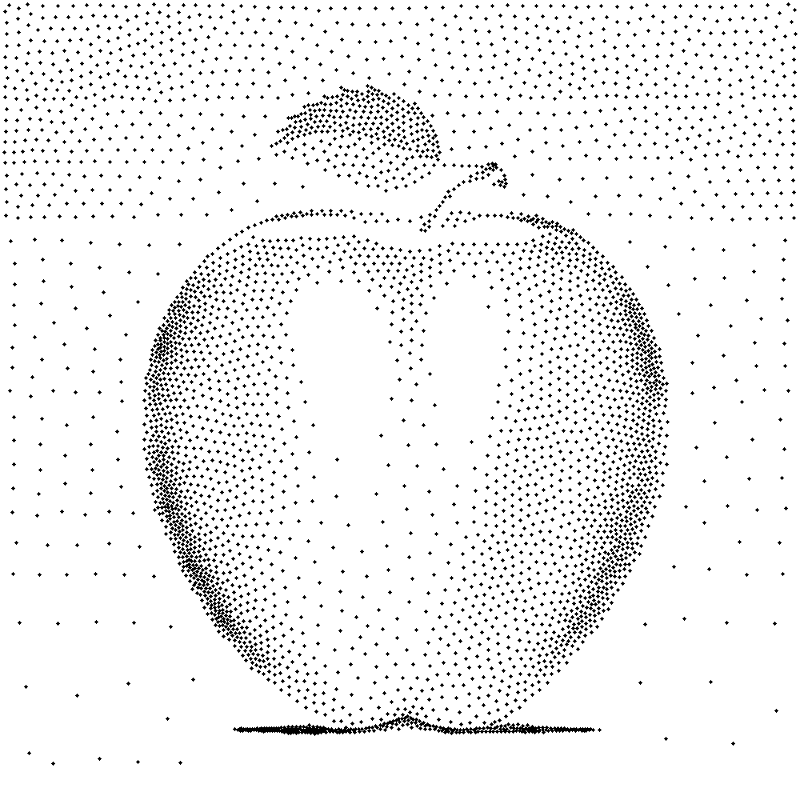

# Weighted Voronoi Stippling

This is an implementation of the following article using OpenCV:

> Weighted Voronoi Stippling, Adrian Secord. In: Proceedings of the 2nd International Symposium on Non-photorealistic Animation and Rendering. NPAR '02. ACM, 2002, pp. 37– 43.

## Result


## Pre-requisites
- C++14 compatible compiler
- OpenCV 4.x
- CMake 2.8+

## Build
```bash
mkdir build && cd build
cmake ..
make
```

## Usage
```
 Usage: Stippling [params] image

	-?, -h, --help, --usage (value:true)
		print this message
	-N, -n, --number
		number of stipple points
	-d, --draw
		show iteration progress
	-e, --epoch
		number of iterations
	-i, --invert
		invert image brightness
	-s, --size
		stipple point radius

	image
		image for rendering
```

## Project Structure
```
include/        # Header files
  CVT.h              # Centroidal Voronoi Tessellation (weighted centroid computation)
  Clipping.h         # Liang-Barsky line clipping & polygon clipping to bounds
  PointPolygonTest.h  # Point-in-polygon test (ray casting)
  ROI.h              # Region of interest cropping
  SimplePolygon.h    # Simple polygon generation from point set
src/            # Main application
  Stippling.cpp      # Entry point & iterative stippling loop
test/           # Unit tests for individual modules
data/           # Sample input images
```